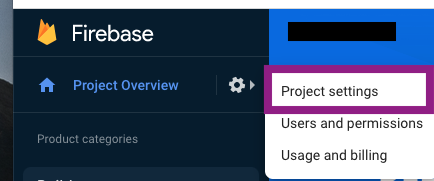
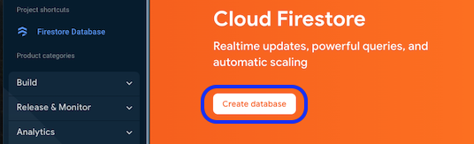

# TimeTracking

In the interest of giving something back to this platform, I wanted to put together a Firebase solution that anybody can freely copy and use for thier own projects.  

This project makes use of the FireStore Database and the Firebase Auth Google user login.

This project will update in real-time whenever there are changes to the back-end database and/or
the user's "logged In/Out" status changes.

I put this together because, sometimes figuring all this out through trial and error, endless searching, hours watching tutorial videos, guessing, and a bunch of StackOverflow can be pretty time consuming.

When I do include external links in this project, I will try to make them as specific as possible.

# Code Set up

***NOTE:*** Is have the '>' as my prompt, so when I write a code segment/command, I have a leading '>' which isn't part of the command, but rather represents my command prompt.  ie:

```
> [THE COMMAND TO TYPE]
```

In this project, I've kept the Firebase specific functionality very localized for understanding's sake.

1st: The FirebaseUtils.ts is the file I am using just to creats/allocate the Firebase specific variables.  There variables are used to access the Firebase functionality.

2nd: The Firebase functionality is contained within the App.tsx file. Specifically:
	
	* Within the useEffect - the onSnapshot allows us to "monitor" the real-time updates of the FireStore Database.

	* The onLogInOut function which is called when the dummy button is clicked (which I removed since it isn't really part of the UI - those its code is just commented out)

	* The onAuthStateChanged function so we are notified whenever the user's "Logged-In" status changes

**NOTE:** There is a minor descrepency between the initial data in the JSON file and the way the FireStore DB is configured so there is a translation function - **BUT** it isn't really relevant to Firebase functionality within a React Project - just something specific to this one.

# Data

The data for this project when originally downloaded from FrontEndMentor is using a JSON file.  
Since JSON is also the format of the Firebase Database, I was able to easily leverage the Firebase Database.  

All I basically did was take the data contained within the original file and set up the database with the same data - and more importatnly, in the same format.

In the Firebase project, I am using the FireStore Database service.  

# Setting up and Configuring Firebase

***FIRST*** You must set up at least one Firebase project


1. Go to https://firebase.google.com/ and then go to the Firebase Console (It should be in the upper righthand side of browser window ):


2. Next, you'll either select an existing Firebase project - or create one.  If you're creating one, select the "Add" option:


* Now just walk through the steps, providing name, etc... 

* Quick note - Firebase projects contain Firebase Applications - This will become relevant in step 3.

Below is a link with more than you'll ever want to know about Firebase projects:

	https://firebase.google.com/docs/projects/learn-more?authuser=0&hl=en


2. Next, you'll want to open the project's settings



3. Scroll down to the bottom of the page and select the button to create a new web application:


4. Give your web app any name you'd like:


5. Now that you've set up your web application in your Firebase project - you're presented with the settings you'll need to incorporate into your React Project:


## WARNING!!!!!!!!  IMPORTANT PART!!!!!

Once you're ready to add in all the project information into your code segment ***DO NOT***
place the configuration keys and IDs into any file which will ever be put into a public repo!!!!!!!!!

Instead, create the following file in the project's root directory - ie: The same level as your package.json file.  Additionally - Make ***ABSOLUTELY CERTAIN*** this file is in your .gitignore so that it ***NEVER*** gets commited to your repo!  ***ESPECIALLY*** a public repo!

```
> touch .env.local
```

The above file's naming convention must be exact

Now, all those crazy numbers and values you see that Firebase is presenting, place those values into your .env.local file.  Below is an example of what your .env.local file might look like (NOTICE - No quotes anywhere).  

Also, the naming convention is critical!  The environment variable's name MUST start with "REACT_APP_" followed by whatever you want - otherwise the variables won't get read in by the environment.

On line 23 of my FirebaseUtils.ts file you can see where I read these variables in.

```
REACT_APP_API_KEY=QRbcMaBCabcORASDVrm123aBcd4F9BcUrsW_ABc
REACT_APP_AUTH_DOMAIN=somecoolprojects-4a4ab.firebaseapp.com
REACT_APP_PROJ_ID=somecoolprojects-4a4ab
REACT_APP_STORAGEBUCKET=somecoolprojects-4a4ab.appspot.com
REACT_APP_MESSAGING_SENDER_ID=246810121418
REACT_APP_APP_ID=8:456789012345:web:i12aaccgg24567w12x3g48
REACT_APP_MEASUREMENT_ID=A-BC1A2987BD
```

***NOTE:***  Lastly, remember that this is a file of environment variables and remember that environment variables are only read in once by an application and that happens only when the app starts.  So, be sure after creating, entering the keys, and saving this file that you restart your IDE.  So if you notice your variables aren't being read in - it's a good bet this is why. 


6. Now go back into your Firebase project and set up the FireStore database.  You'll need to select the service to create, then create it:

Select the service (The database and authentication are selected for display purposes.  You'll do the same for both, just one at a time.)


- Instantiate the FireStore service (We'll look at setting up the DB itself in a moment)



***NOTE:*** For a test/dev project, using the initial testing permissions will probably serve you best until you understand Firebases security rules. Below is a good place to learn more.

https://firebase.google.com/docs/rules

- Instantiate the Authentication service (We'll set this up here at the same time)


The database is set up as follows:

```
	Collection -> Document -> Collection -> Document -> [PATTERN REPEATS]
```

Essentially, a document must reside within a collection and documents canNOT contain other documents.

CAVEAT! - A document CAN contain a collection, which can then contain additional documents.
Below is a very useful link to explain this a little further.

https://firebase.google.com/docs/firestore/data-model


### Setting up Firebase with your React project

The first thing you'll want to do when setting up your React project with Firebase is to install firebase.

```
> npm install firebase
```

Below is a good link to get the overall concept to get firebase integrated when you're ready to dig in deeper.

https://firebase.google.com/docs/firestore/quickstart


### The additional npms in this project:

	I'm not really using anything much on this project other than SASS.

	```
	> npm install sass
	```

	NOTE: The only reason I'm using SASS is because I like the easy one line comment syntax and I like the syntax it uses for declaring variables.  Everything else is 100% pure CSS so don't worry if you don't know SASS very well.


# Go to https://firebase.google.com/

In the upper portion of the page "Go to console" 
* Here either select an existing project or create/Add a new one

In the upper righthand corner select the cog wheel next to "Project Overview"
* Then select "Project settings"

Scroll to the bottom of the page and if no app has been created, select the button to create 
a new web app.  It looks sort'a like an empty HTML tag (</>)

Then name it whatever you'd like
